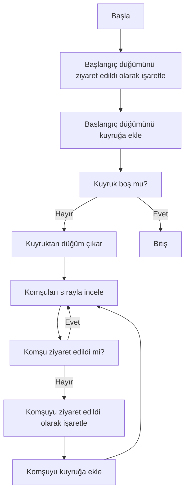
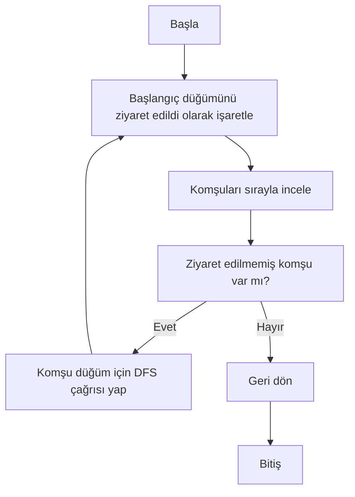
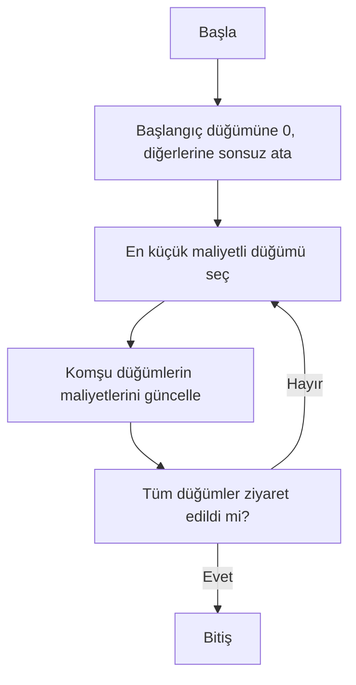
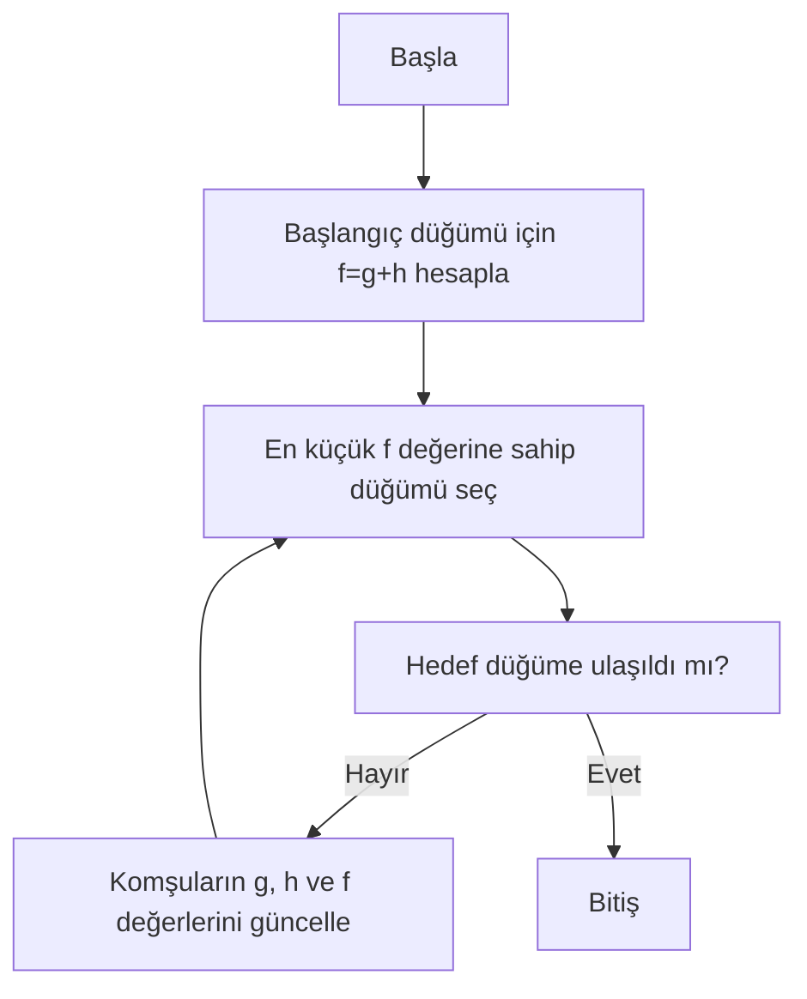
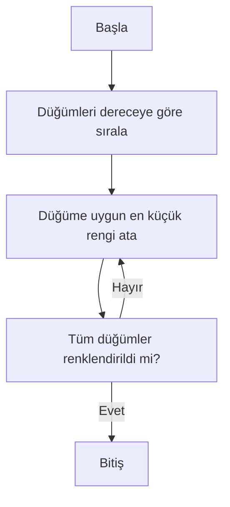
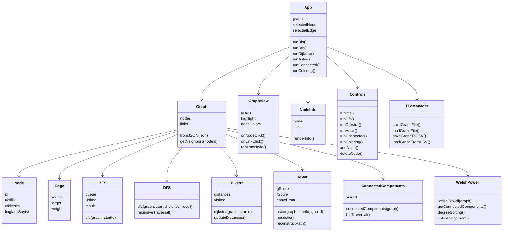

# Sosyal Ağ Analizi Uygulaması

**Proje:** Sosyal Ağ Analizi 

**Bölüm:** Bilişim Sistemleri Mühendisliği  

**Ekip Üyeleri:**  
- Emre Beraat Samuk – 241307136  
- Metehan Yüksek – 241307137  

**Tarih:** 28.12.2025

## Problem Tanımı ve Amaç

Sosyal ağlar, kullanıcılar arasındaki ilişkilerin karmaşık ve yoğun bir biçimde etkileşim gösterdiği yapılardır. Bu tür sistemlerin analizinde, kullanıcıların ve aralarındaki bağlantıların etkin bir şekilde modellenmesi büyük önem taşımaktadır. Graf veri yapıları, düğümler ve kenarlar aracılığıyla sosyal ağların matematiksel olarak ifade edilmesini sağlayan en uygun yapılardan biridir.

Bu projede, kullanıcılar arasındaki ilişkileri ağırlıklı ve yönsüz bir graf yapısı ile modelleyen bir **Sosyal Ağ Analizi Uygulaması** geliştirilmiştir. Uygulama, dinamik olarak düğüm ve bağlantı yönetimine olanak tanımakta ve oluşturulan ağ üzerinde çeşitli graf algoritmalarının çalıştırılmasını desteklemektedir.

Projenin amacı; graf algoritmalarının (BFS, DFS, Dijkstra, A* vb.) gerçek bir problem üzerinde uygulanmasını sağlamak, nesne yönelimli programlama prensiplerine uygun bir yazılım mimarisi tasarlamak ve analiz sonuçlarını görsel olarak sunabilen etkileşimli bir sistem geliştirmektir.

## 3. Projede Gerçeklenen Algoritmalar

Bu bölümde, sosyal ağ grafı üzerinde gerçekleştirilen algoritmaların çalışma mantıkları, akış diyagramları, zaman ve alan karmaşıklıkları ile literatürdeki yerleri açıklanmaktadır.

---

### 3.1 Breadth First Search (BFS)

**Çalışma Mantığı:**  
BFS algoritması, verilen bir başlangıç düğümünden itibaren grafı katman katman dolaşarak erişilebilen tüm düğümleri bulur. Algoritma, kuyruk (queue) veri yapısını kullanır ve önce en yakın komşuları ziyaret eder.

**Kullanım Amacı:**

Bir kullanıcıdan erişilebilen tüm kullanıcıların tespit edilmesi.

**Zaman Karmaşıklığı:**  
O(V + E)

**Alan Karmaşıklığı:**

O(V)

**Akış Diyagramı:**

---

### 3.2 Depth First Search (DFS)

**Çalışma Mantığı:**  
Depth First Search (DFS) algoritması, bir başlangıç düğümünden başlayarak graf üzerinde mümkün olan en derin seviyeye kadar ilerler. Bir düğümün ziyaret edilmemiş komşusu kalmadığında geri izleme (backtracking) yaparak diğer düğümleri ziyaret eder. Algoritma, özyineleme (recursive) veya yığın (stack) veri yapısı kullanılarak gerçekleştirilebilir.

**Kullanım Amacı:**  
Grafın yapısal analizinde, erişilebilir düğümlerin bulunmasında ve bağlı bileşenlerin tespit edilmesinde kullanılır.

**Zaman Karmaşıklığı:**  
O(V + E)

**Alan Karmaşıklığı:**  
O(V)

**Akış Diyagramı:**

---

### 3.3 Dijkstra En Kısa Yol Algoritması

**Çalışma Mantığı:**  
Dijkstra algoritması, ağırlıklı bir graf üzerinde bir başlangıç düğümünden diğer tüm düğümlere olan en kısa yolları hesaplar. Algoritma, her adımda henüz ziyaret edilmemiş düğümler arasından en düşük maliyetli olanı seçerek ilerler. Bu projede kenar ağırlıkları dinamik olarak hesaplanan maliyet değerlerine göre belirlenmektedir.

**Kullanım Amacı:**  
İki kullanıcı arasındaki en düşük maliyetli yolun bulunması.

**Zaman Karmaşıklığı:**  
O((V + E) log V)

**Alan Karmaşıklığı:**  
O(V)

**Akış Diyagramı:**

---

### 3.4 A* En Kısa Yol Algoritması

**Çalışma Mantığı:**  
A* algoritması, Dijkstra algoritmasını sezgisel (heuristic) bir fonksiyon ile geliştirerek daha verimli bir en kısa yol araması yapar. Algoritma, her düğüm için gerçek maliyet (g) ve hedefe olan tahmini maliyetin (h) toplamını ifade eden f = g + h değerini kullanır.

**Kullanım Amacı:**  
Büyük ve karmaşık graflarda daha hızlı en kısa yol hesaplaması.

**Zaman Karmaşıklığı:**  
Heuristic fonksiyonuna bağlıdır (en kötü durumda O(E))

**Alan Karmaşıklığı:**  
O(V)

**Akış Diyagramı:**

---

### 3.5 Welsh–Powell Graf Renklendirme Algoritması

**Çalışma Mantığı:**  
Welsh–Powell algoritması, graf renklendirme problemini çözmek için kullanılan sezgisel bir yaklaşımdır. Algoritmada düğümler, derecelerine göre azalan sırada dizilir ve her düğüme, komşu düğümlerle aynı renk olmayacak şekilde en küçük uygun renk atanır.

**Kullanım Amacı:**  
Ayrık toplulukların ve komşu düğümlerin görsel olarak ayırt edilmesini sağlamak.

**Zaman Karmaşıklığı:**  
O(V²)

**Alan Karmaşıklığı:**  
O(V)

**Akış Diyagramı:**

---

## 4. Projenin Sınıf Yapısı ve Modüler Tasarımı

Bu bölümde, geliştirilen Sosyal Ağ Analizi Uygulamasının sınıf yapısı, modülleri ve bu bileşenler arasındaki ilişkiler açıklanmaktadır. Proje, nesne yönelimli programlama (OOP) prensiplerine uygun olarak katmanlı ve modüler bir mimari ile tasarlanmıştır. Bu yaklaşım, sistemin sürdürülebilirliğini ve genişletilebilirliğini artırmaktadır.

---

### 4.1 Genel Mimari Yapı

Uygulama mimarisi aşağıdaki dört ana katmandan oluşmaktadır:

- **Veri Modeli (Graph Model Layer)**
- **Algoritma Katmanı (Algorithm Layer)**
- **Kullanıcı Arayüzü Katmanı (UI / Presentation Layer)**
- **Veri Saklama Katmanı (Persistence Layer)**

`App.js` dosyası, bu katmanlar arasında koordinasyonu sağlayan ana kontrol bileşeni olarak görev yapmaktadır.

---

### 4.2 Veri Modeli

Veri modeli, sosyal ağı temsil eden temel sınıflardan oluşmaktadır. Bu katman, algoritmaların çalıştığı soyut graf yapısını tanımlar.

#### 4.2.1 Node Sınıfı

**Node** sınıfı, sosyal ağdaki her bir kullanıcıyı temsil etmektedir. Her düğüm, kullanıcıya ait çeşitli niteliksel ve niceliksel özellikleri barındırır.

Node sınıfının temel sorumlulukları:
- Kullanıcı kimliğini (ID) tutmak
- Aktiflik, etkileşim ve bağlantı sayısı gibi özellikleri saklamak
- Algoritmalar için düğüm bazlı veri sağlamak

Bu yapı sayesinde düğümler, sosyal ağ analizinde bağımsız ve anlamlı varlıklar hâline gelmektedir.

---

#### 4.2.2 Edge Sınıfı

**Edge** sınıfı, iki düğüm arasındaki ilişkiyi temsil etmektedir. Kenarlar yönsüz ve ağırlıklıdır.

Edge sınıfının görevleri:
- Kaynak ve hedef düğümleri tanımlamak
- Düğümler arasındaki ilişkinin ağırlığını tutmak
- En kısa yol ve renklendirme algoritmalarına girdi sağlamak

Kenar ağırlıkları, düğümlerin özelliklerine göre hesaplanarak sosyal ilişkilerin gücünü yansıtmaktadır.

---

#### 4.2.3 Graph Sınıfı

**Graph** sınıfı, Node ve Edge nesnelerini bir araya getiren temel veri yapısıdır. Uygulamadaki tüm algoritmalar bu sınıf üzerinden çalışmaktadır.

Graph sınıfının başlıca görevleri:
- Düğüm ve kenarların eklenmesi, silinmesi ve güncellenmesi
- Komşuluk ilişkilerinin yönetilmesi
- Algoritmalar için gerekli graf verisinin sağlanması
- JSON formatındaki verinin `Graph.fromJSON()` metodu ile nesne yönelimli yapıya dönüştürülmesi

Bu sınıf, uygulamanın çekirdek bileşeni olup veri modeli ile algoritma katmanı arasında köprü görevi görmektedir.

---

### 4.3 Algoritma Katmanı

Graf üzerinde gerçekleştirilen tüm algoritmalar, ayrı modüller halinde tasarlanmıştır. Her algoritma, Graph nesnesini parametre olarak alır ve kullanıcı arayüzünden bağımsız şekilde çalışır.

Projede kullanılan algoritmalar:
- **BFS (`bfs.js`)** – Genişlik öncelikli arama
- **DFS (`dfs.js`)** – Derinlik öncelikli arama
- **Dijkstra (`dijkstra.js`)** – En kısa yol algoritması
- **A* (`astar.js`)** – Sezgisel en kısa yol algoritması
- **Connected Components (`connected.js`)** – Bağlı bileşen analizi
- **Welsh–Powell (`welshPowell.js`)** – Graf renklendirme algoritması

Bu modüler yapı, algoritmaların kolayca değiştirilmesine ve yeni algoritmaların eklenmesine olanak tanımaktadır.

---

### 4.4 Kullanıcı Arayüzü Katmanı

Kullanıcı arayüzü, React bileşenleri kullanılarak geliştirilmiştir.

- **App.js**  
  Uygulamanın ana bileşenidir. Graf durumunu yönetir, algoritmaları tetikler ve kullanıcı etkileşimlerini kontrol eder. MVC benzeri mimaride controller rolünü üstlenmektedir.

- **GraphView**  
  Grafın görselleştirilmesini sağlar ve düğüm/kenar etkileşimlerini yönetir.

- **NodeInfo**  
  Seçilen düğüme ait detaylı bilgileri kullanıcıya sunar.

- **Controls**  
  Algoritma çalıştırma, düğüm ve bağlantı işlemleri ile dosya kontrollerini içeren paneldir.

---

### 4.5 Veri Saklama Katmanı

- **fileManager (`utils/fileManager.js`)**

Bu modül, graf verisinin JSON ve CSV formatlarında kaydedilmesi ve yüklenmesi işlemlerinden sorumludur. Bu sayede uygulama, kalıcı veri desteği sunmaktadır.

---

### 4.6 Sınıf ve Modül İlişkileri

---

## 5. Uygulamaya Ait Açıklamalar, Ekran Görüntüleri, Test Senaryoları ve Sonuçlar

Bu bölümde geliştirilen uygulamanın genel mimarisi, kullanıcı arayüzü, test senaryoları ve elde edilen deneysel sonuçlar sunulmaktadır. 
Uygulama, farklı ölçeklerde oluşturulan graflar üzerinde çeşitli grafik algoritmalarının çalışmasını görselleştirmek ve algoritmaların performanslarını karşılaştırmak amacıyla geliştirilmiştir.

---

### 5.1 Uygulama Arayüzü ve Temel İşlevler

Geliştirilen uygulama; grafik oluşturma, düğüm ve kenar ekleme, algoritma seçimi ve sonuçların görselleştirilmesi gibi temel işlevleri içermektedir. 
Kullanıcılar, JSON formatında veri yükleyerek veya manuel giriş yaparak grafik oluşturabilmekte ve seçilen algoritmanın çalışma sürecini görsel olarak izleyebilmektedir.

**Şekil 5.1.1.** Uygulama ana ekranı ve grafik görselleştirme arayüzü  

---

### 5.2 Test Senaryoları

Algoritmaların doğruluğu ve performansı, farklı düğüm sayılarına sahip grafikler üzerinde test edilmiştir. 
Testler iki ana senaryo altında gerçekleştirilmiştir:

- **Orta Ölçekli Grafikler:** 75 düğüm  
- **Büyük Ölçekli Grafikler:** 100 düğüm  

Her bir senaryoda aşağıdaki algoritmalar uygulanmıştır:

- BFS (Breadth First Search)
- DFS (Depth First Search)
- Dijkstra
- A*
- Bağlı Bileşenler (Connected Components)
- Welsh–Powell Grafik Renklendirme
- En Etkili Düğümler Analizi

---

### 5.3 Deneysel Sonuçlar (75–100 Düğüm)

Orta ölçekli (75 düğüm) ve büyük ölçekli (100 düğüm) grafikler üzerinde gerçekleştirilen deneylerde, her algoritma için elde edilen görsel çıktılar ve yaklaşık çalışma süreleri sırasıyla Tablo 5.3.1 ve Tablo 5.3.2’de sunulmuştur.

**Tablo 5.3.1.** 75 düğümlü grafik için algoritma sonuçları

| Algoritma | Sonuç Görseli | Çalışma Süresi |
|---------|--------------|---------------|
| **BFS** |  | 0.2 ms |
| **DFS** |  | 0.1 ms |
| **Dijkstra** |  | 0.4 ms |
| **A\*** |  | 0.3 ms |
| **Bağlı Bileşenler** |  | 0.3 ms |
| **Welsh–Powell Renklendirme** |  | 5.8 ms |
| **En Etkili Düğümler** |  | 0.3 ms |

---

**Tablo 5.3.2.** 100 düğümlü grafik için algoritma sonuçları

| Algoritma | Sonuç Görseli | Çalışma Süresi |
|---------|--------------|---------------|
| **BFS** |  | 0.3 ms |
| **DFS** |  | 0.4 ms |
| **Dijkstra** |  | 0.7 ms |
| **A\*** |  | 0.3 ms |
| **Bağlı Bileşenler** |  | 0.3 ms |
| **Welsh–Powell Renklendirme** |  | 13.4 ms |
| **En Etkili Düğümler** |  | 0.8 ms |

---

### 5.4 Sonuçların Değerlendirilmesi

Deneysel sonuçlar incelendiğinde, BFS ve DFS algoritmalarının düşük çalışma sürelerine sahip olduğu, ancak ağırlıklı graf yapılarında en kısa yol problemleri için uygun olmadığı görülmüştür. 
Dijkstra ve A* algoritmaları, ağırlıklı graflarda doğru ve tutarlı sonuçlar üretmiş; A* algoritması, sezgisel (heuristic) yaklaşımı sayesinde bazı senaryolarda Dijkstra algoritmasına kıyasla daha kısa sürede sonuç vermiştir. 
Welsh–Powell algoritmasının ise grafik renklendirme problemine özgü yapısı nedeniyle, düğüm sayısı arttıkça çalışma süresinin belirgin şekilde yükseldiği gözlemlenmiştir.

Elde edilen bu bulgular, algoritmaların teorik karmaşıklık analizleri ile uyumlu sonuçlar ortaya koymaktadır.

---

## 6. Sonuç ve Tartışma

Bu projede, sosyal ağları temsil eden graf yapıları üzerinde çeşitli grafik algoritmalarının uygulanabildiği etkileşimli bir analiz ve görselleştirme uygulaması geliştirilmiştir. 
Geliştirilen sistem, hem teorik olarak öğrenilen graf algoritmalarının pratikte uygulanmasını sağlamış hem de bu algoritmaların farklı ölçeklerdeki graflar üzerindeki davranışlarını karşılaştırmalı olarak inceleme imkânı sunmuştur.

---

### 6.1 Projenin Başarıları

Proje kapsamında aşağıdaki hedefler başarıyla gerçekleştirilmiştir:

- Sosyal ağ yapıları, düğüm ve kenarlardan oluşan ağırlıklı ve yönsüz graf modeli ile başarıyla temsil edilmiştir.
- BFS, DFS, Dijkstra, A*, Bağlı Bileşenler ve Welsh–Powell algoritmaları eksiksiz biçimde gerçeklenmiş ve görselleştirilmiştir.
- Kullanıcıların farklı boyutlarda grafikler oluşturabilmesine ve algoritmaların çalışma adımlarını görsel olarak takip edebilmesine olanak sağlayan etkileşimli bir arayüz tasarlanmıştır.
- Orta ve büyük ölçekli grafikler üzerinde gerçekleştirilen testler ile algoritmaların performansları ölçülmüş ve elde edilen sonuçlar tablo ve görseller ile desteklenmiştir.
- Deneysel sonuçların, algoritmaların teorik zaman karmaşıklıkları ile uyumlu olduğu gözlemlenmiştir.

---

### 6.2 Sınırlılıklar

Her ne kadar proje hedeflerine büyük ölçüde ulaşılmış olsa da, mevcut uygulamanın bazı sınırlılıkları bulunmaktadır:

- Algoritmaların çalışma süreleri, tarayıcı tabanlı bir ortamda ölçüldüğü için donanım ve tarayıcıya bağlı olarak değişkenlik gösterebilmektedir.
- Çok büyük ölçekli (binlerce düğüm içeren) grafiklerde, görselleştirme performansında düşüşler gözlemlenebilmektedir.
- A* algoritmasında kullanılan sezgisel fonksiyonun basit tutulması, bazı senaryolarda algoritmanın potansiyel performans avantajının tam olarak ortaya çıkmasını engellemektedir.
- Uygulama, şu an için yönsüz grafikler üzerine odaklanmakta olup yönlü grafik desteği sınırlıdır.

---

### 6.3 Gelecek Çalışmalar ve Olası Geliştirmeler

Projenin ilerleyen aşamalarında aşağıdaki geliştirmelerin yapılması planlanabilir:

- Daha gelişmiş ve problem odaklı sezgisel fonksiyonlar kullanılarak A* algoritmasının performansının artırılması.
- Yönlü ve dinamik grafik yapılarının desteklenmesi.
- Daha büyük ölçekli ağlar için performans iyileştirmeleri ve arka planda çalışan algoritma yürütme mekanizmalarının geliştirilmesi.
- Merkeziyet, topluluk algılama ve en kısa yol varyantları gibi ek sosyal ağ analiz algoritmalarının sisteme dahil edilmesi.

---

